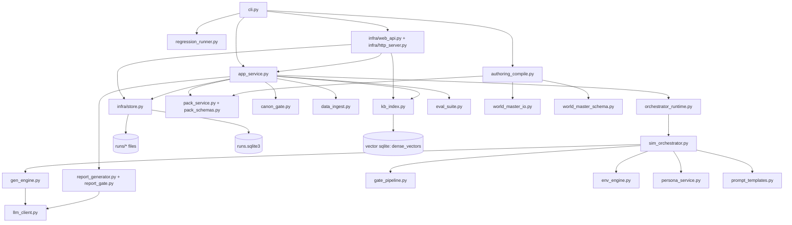

# Project Dream 현재 아키텍처 맵 (2026-03-01 업데이트)

## 0. 문서 목적

- 이 문서는 `main` 브랜치 기준 현재 구현 상태를 빠르게 파악하기 위한 구조도이다.
- 초점: `모듈 책임`, `모듈 간 연결`, `핵심 상태 변수`, `환경변수`, `저장소/인터페이스`.

---

## 1. 최상위 구조

```text
project_dream/
├─ src/project_dream/           # 애플리케이션 코드
│  ├─ infra/                    # HTTP 서버/저장소 구현
│  └─ *.py                      # 시뮬레이션, 평가, 리포트, KB, CLI
├─ authoring/                   # 작가 작성용 world master/world pack 소스(JSON)
├─ packs/                       # 런타임 pack 데이터(JSON)
├─ corpus/                      # ingest 산출 코퍼스(JSONL + manifest)
├─ runs/                        # 실행 결과(runlog/report/eval/regression)
├─ scripts/                     # 로컬 운영 스크립트
├─ tests/                       # 단위/E2E 테스트
└─ docs/                        # 설계/진척 문서
```

---

## 2. 레이어 구조도



---

## 3. 핵심 실행 흐름

### 3.1 `simulate` 흐름

1. `cli.py`에서 `SeedInput` 로드 및 repository(`file` 또는 `sqlite`) 선택.
2. `app_service.simulate_and_persist`:
   - `load_packs(enforce_phase1_minimums=True)`
   - `enforce_canon_gate(seed, packs)` 하드 게이트
   - `build_index(...)` + `retrieve_context(...)`
   - `load_corpus_texts(...)`와 context corpus 병합
   - `run_simulation_with_backend(...)` 실행
   - `build_report_v1(...)` 생성
   - repository로 `persist_run(...)`
3. 결과물: `runs/run-*/runlog.jsonl`, `report.json`, `report.md`

### 3.2 `evaluate` 흐름

1. 최신 run 또는 지정 run 선택.
2. `eval_suite.evaluate_run`에서 runlog/report 검사 + metric 계산.
3. `eval.json` 저장, (sqlite backend면 runs 테이블 `eval_pass` 업데이트).

### 3.3 `regress` / `regress-live` 흐름

1. seeds 디렉터리 순회.
2. seed마다 simulate + report + evaluate 반복.
   - 각 seed 실행 전 `enforce_canon_gate(...)` 적용
3. 집계 게이트(`community_coverage`, `stage_trace_*`, `report_gate_pass_runs` 등) 평가.
4. `runs/regressions/regression-*.json` 저장.
5. `regress-live`는 실행 중 LLM env를 강제로 `google/model_output`로 오버라이드하고 baseline 비교까지 수행.

### 3.4 `serve`(HTTP API) 흐름

1. `ProjectDreamAPI.for_local_filesystem(...)` 생성.
2. `infra/http_server.py`가 토큰 인증 + 라우팅 처리.
3. API 메서드는 `app_service`, `kb_index`, `RunRepository`로 위임.

### 3.5 `compile`(authoring -> runtime pack) 흐름

1. `cli.py compile`에서 `authoring_dir`, `packs_dir`를 입력받음.
2. `authoring_compile.compile_world_pack(...)`:
   - 입력 우선순위로 로드
     - `authoring/world_master/`(split)
     - `authoring/world_master.json`(single)
     - `authoring/world_pack.json`
     - `authoring/world_meta.json + world_*.json`
   - `world_master`면 `world_master_schema.project_world_master_to_world_pack(...)`로 투영
   - `WorldPackPayload` 검증 후 `packs/world_pack.json` 저장
   - `write_pack_manifest(...)`로 checksum 자동 동기화
   - `world_master` 입력 사용 시 single/split 포맷 자동 동기화 export
3. 결과물: `packs/world_pack.json`, `packs/pack_manifest.json`

---

## 4. 모듈별 상세 지도

### 4.1 Entry/Application 레이어

| 모듈 | 핵심 함수/클래스 | 역할 | 주요 입력/상태 변수 | 주요 연결 |
|---|---|---|---|---|
| `cli.py` | `build_parser`, `main` | CLI 명령 진입점 | `command`, `repo-backend`, `orchestrator-backend`, `vector-backend`, `llm-model`, baseline 옵션, `world-master-export-*` | `app_service`, `regression_runner`, `authoring_compile`, `infra.web_api`, `infra.http_server` |
| `app_service.py` | `simulate_and_persist`, `evaluate_and_persist`, `regress_and_persist` | 애플리케이션 유스케이스 조합 | `seed`, `rounds`, `packs_dir`, `corpus_dir`, `orchestrator_backend`, `vector_backend` | `pack_service`, `kb_index`, `orchestrator_runtime`, `report_generator`, `eval_suite`, `infra.store` |
| `regression_runner.py` | `run_regression_batch` | 배치 회귀 실행/집계 | `min_community_coverage`, `min_conflict_frame_runs`, `min_moderation_hook_runs`, `metric_set` | `pack_service`, `kb_index`, `orchestrator_runtime`, `report_generator`, `eval_suite`, `storage` |
| `authoring_compile.py` | `compile_world_pack` | authoring world 데이터 -> runtime world pack 컴파일/동기화 | `authoring_dir`, `packs_dir`, `world_master_export_file/dir` | `world_master_io`, `world_master_schema`, `pack_schemas`, `pack_service` |
| `regression_summary.py` | `write_job_summary` | regression JSON -> markdown 요약 변환 | `regressions_dir`, `output_file` | filesystem |
| `eval_export.py` | `export_external_eval_bundle` | 외부 평가용(promptfoo/ragas/trace) 번들 생성 | `max_contexts`, runlog rows | filesystem |

### 4.2 오케스트레이션/시뮬레이션 레이어

| 모듈 | 핵심 함수/클래스 | 역할 | 주요 입력/상태 변수 | 주요 연결 |
|---|---|---|---|---|
| `orchestrator_runtime.py` | `run_simulation_with_backend`, `StageNodeExecutionError` | 수동/`langgraph` 백엔드 공통 실행기 | `backend`, `max_stage_retries`, `SIMULATION_STAGE_NODE_ORDER`, `checkpoint_log` | `sim_orchestrator` |
| `sim_orchestrator.py` | `run_simulation`, `extract_stage_payloads`, `assemble_sim_result_from_stage_payloads` | 라운드 루프 및 stage payload 조립 | `status`, `sanction_level`, `total_reports`, `total_views`, `persona_memory`, `ROUND_LOOP_NODE_ORDER` | `gen_engine`, `gate_pipeline`, `env_engine`, `persona_service`, `prompt_templates` |
| `canon_gate.py` | `run_canon_gate`, `enforce_canon_gate` | 시뮬레이션 전 세계관 정합성 하드 게이트 | `reference_integrity`, `timeline_consistency`, `relation_conflicts`, `glossary_conflicts`, `seed_forbidden_terms` | `app_service`, `regression_runner`, `pack_service`, `models.SeedInput` |
| `gen_engine.py` | `generate_comment` | 2단계 생성(stage1 plan + stage2 render) | `stage1_trace`, `stage2_trace`, `voice_constraints`, `memory_hint`, `_LAST_GENERATION_TRACE` | `llm_client`, `prompt_templates`, `models` |
| `gate_pipeline.py` | `run_gates` | safety/similarity/lore 검증 및 재작성 | `PHONE_PATTERN`, `TABOO_WORDS`, `EVIDENCE_KEYWORDS`, `CONTRADICTION_TERM_GROUPS`, `similarity_threshold` | `rapidfuzz`, `prompt_templates` |
| `env_engine.py` | `compute_score`, `apply_policy_transition`, `rank_threads_for_tab` | 정책 전이/점수 계산 | `_ACCOUNT_*`, `_ACTION_BASE_COST`, `_TAB_SCORE_MULTIPLIER`, `_STATUS_FLOOR_LEVEL` | `sim_orchestrator` |
| `persona_service.py` | `select_participants`, `render_voice` | 라운드 참여자 선정 + 화법 제약 생성 | `_VOICE_BY_ARCHETYPE`, `_ZONE_TABOO_WORDS`, `_FALLBACK_BASE` | `models`, `packs` |
| `prompt_templates.py` | `PROMPT_TEMPLATE_REGISTRY`, `render_prompt` | 프롬프트 템플릿 렌더링 | `template_set`, `template_key`, `variables` | `gen_engine`, `report_generator`, `gate_pipeline`, `sim_orchestrator` |

### 4.3 데이터/지식 레이어

| 모듈 | 핵심 함수/클래스 | 역할 | 주요 입력/상태 변수 | 주요 연결 |
|---|---|---|---|---|
| `pack_schemas.py` | `*_Row`, `*_PackPayload`, `validate_pack_payload` | pack JSON strict validation(extra forbid) | `WorldPackPayload(world_schema.v1, extensions)`, `StrictStr/StrictInt`, `EscalationRule` | `pack_service`, `authoring_compile` |
| `pack_service.py` | `LoadedPacks`, `load_packs`, `write_pack_manifest` | pack 로드/정규화/참조 무결성/manifest checksum 관리 | `_FLOW_TABOO_HINTS`, `enforce_phase1_minimums`, `pack_manifest`, `pack_fingerprint` | `pack_schemas`, `app_service`, `regression_runner`, `authoring_compile` |
| `world_master_schema.py` | `validate_world_master_payload`, `project_world_master_to_world_pack` | 작성용 world master 스키마 검증 및 runtime world pack 투영 | `nodes/edges/events/rules/glossary/source_documents/claims/taxonomy_terms`, `kind_registry` | `authoring_compile`, `world_master_io` |
| `world_master_io.py` | `load_world_master_file`, `load_world_master_split_dir`, `write_world_master_*` | world master 단일/분할 포맷 입출력 및 동기화 | `authoring/world_master.json`, `authoring/world_master/*.json` | `authoring_compile`, `world_master_schema` |
| `data_ingest.py` | `build_corpus_from_packs`, `load_corpus_rows`, `load_corpus_texts` | pack 기반 코퍼스 생성/로딩 | `DEFAULT_DIAL`, `reference/refined/generated` | `pack_service` |
| `kb_index.py` | `build_index`, `search`, `retrieve_context` | 하이브리드 검색(BM25 + char-ngram cosine) | `vector_backend`, `vector_db_path`, `_sqlite_dense_cache`, `df/doc_count/avg_doc_len` | `pack_service`, `data_ingest`, `infra.web_api`, `app_service` |

### 4.4 리포트/평가 레이어

| 모듈 | 핵심 함수/클래스 | 역할 | 주요 입력/상태 변수 | 주요 연결 |
|---|---|---|---|---|
| `report_generator.py` | `build_report_v1` | 시뮬레이션 결과를 report.v1로 변환 | `lens_summaries`, `highlights_top10`, `conflict_map`, `dialogue_candidates`, `risk_checks` | `llm_client`, `report_gate`, `models`, `prompt_templates` |
| `report_gate.py` | `run_report_gate` | report 출력 형식/품질 규칙 검증 | `REQUIRED_REPORT_KEYS`, `VALID_RISK_SEVERITIES` | `eval_suite` |
| `eval_suite.py` | `evaluate_run` | runlog/report/eval 지표 계산 및 pass/fail | `REQUIRED_STAGE_EVENT_TYPES`, `METRIC_SET_REGISTRY(v1,v2)`, `stage_trace_*` | `models` |

### 4.5 인프라/저장소/인터페이스 레이어

| 모듈 | 핵심 함수/클래스 | 역할 | 주요 입력/상태 변수 | 주요 연결 |
|---|---|---|---|---|
| `infra/web_api.py` | `ProjectDreamAPI` | HTTP 계층에서 호출하는 앱 API facade | `repository_backend`, `vector_backend`, `vector_db_path` | `app_service`, `kb_index`, `infra.store` |
| `infra/http_server.py` | `create_server`, `serve` | HTTP 라우팅/인증/오류 매핑 | `api_token`, `Authorization: Bearer`, request log(`method/path/status/latency_ms/auth_ok`) | `infra.web_api`, `orchestrator_runtime` |
| `infra/store.py` | `RunRepository`, `FileRunRepository`, `SQLiteRunRepository` | run/eval/regression 저장소 추상화 + 구현 | `runs` table, `regression_summaries` table, runlog 요약 추출 | `storage`, `eval_suite` |
| `storage.py` | `persist_run`, `persist_eval`, `render_report_markdown` | run 폴더 산출물 파일 저장 | run id 생성 규칙, runlog row 타입 기록 | filesystem |
| `llm_client.py` | `build_default_llm_client`, `GoogleAIStudioLLMClient`, `EchoLLMClient` | LLM provider 선택/호출/캐시 | `PROJECT_DREAM_LLM_*`, `GOOGLE_API_KEY`, `GEMINI_API_KEY`, `cache_path`, `response_mode` | `gen_engine`, `report_generator` |
| `models.py` | `SeedInput`, `ReportV1`, `EvalResult` 등 | Pydantic 데이터 계약 | `Dial(U,E,M,S,H)`, `schema_version` | 전 모듈 공통 |

---

## 5. 핵심 데이터 구조와 상태 변수

### 5.1 입력 모델

- `SeedInput`: `seed_id`, `title`, `summary`, `board_id`, `zone_id`, `dial`, `public_facts`, `hidden_facts`, `stakeholders`, `forbidden_terms`, `sensitivity_tags`, `evidence_grade`, `evidence_type`, `evidence_expiry_hours`
- `Dial`: `U`, `E`, `M`, `S`, `H`

### 5.2 시뮬레이션 상태 변수(`sim_orchestrator.py`)

- 라운드 루프 상태:
  - `status` (`visible`/`hidden`/`locked`/`ghost`/`sanctioned`)
  - `sanction_level` (0~5)
  - `total_reports`
  - `total_views`
  - `ended_early`
  - `termination_reason`
- 선택/템플릿 상태:
  - `selected_thread`
  - `selected_title_pattern`
  - `selected_trigger_tags`
  - `selected_body_sections`
  - `template_taboos`
- 메모리 상태:
  - `persona_memory: dict[str, list[str]]`

### 5.3 `sim_result` 핵심 키

- `thread_candidates`, `selected_thread`
- `rounds`, `gate_logs`, `action_logs`
- `round_summaries`, `moderation_decisions`
- `end_condition`, `thread_state`, `persona_memory`
- runtime 확장 키:
  - `graph_node_trace`
  - `context_bundle`
  - `context_corpus`
  - `orchestrator_backend`
  - `seed`
  - `pack_manifest`
  - `pack_fingerprint`

### 5.4 runlog row 타입(`storage.persist_run`)

- `context`
- `thread_candidate`
- `thread_selected`
- `round`
- `gate`
- `action`
- `round_summary`
- `moderation_decision`
- `end_condition`
- `graph_node`
- `graph_node_attempt`
- `stage_checkpoint`

### 5.5 산출 모델

- `report.v1`:
  - `schema_version`, `seed_id`, `title`, `summary`
  - `lens_summaries`, `highlights_top10`
  - `conflict_map`, `dialogue_candidates`, `foreshadowing`, `risk_checks`
  - `seed_constraints`, `evidence_watch`, `story_checklist`
  - `report_gate`
- `eval.v1`:
  - `metric_set`, `run_id`, `seed_id`, `pass_fail`, `checks`, `metrics`
- `regression.v1`:
  - `config`, `totals`, `gates`, `runs`, `pass_fail`, `summary_path`

---

## 6. 환경변수 맵

### 6.1 LLM 관련

- `PROJECT_DREAM_LLM_PROVIDER`
- `PROJECT_DREAM_LLM_MODEL`
- `PROJECT_DREAM_LLM_API_KEY` (옵션)
- `GOOGLE_API_KEY`
- `GEMINI_API_KEY`
- `PROJECT_DREAM_LLM_RESPONSE_MODE` (`prompt_passthrough` / `model_output`)
- `PROJECT_DREAM_LLM_TIMEOUT_SEC`
- `PROJECT_DREAM_LLM_CACHE_PATH`

### 6.2 서버/실행 관련

- `PROJECT_DREAM_API_TOKEN` (필수)
- `PROJECT_DREAM_HOST`
- `PROJECT_DREAM_PORT`
- `PROJECT_DREAM_RUNS_DIR`
- `PROJECT_DREAM_PACKS_DIR`
- `PROJECT_DREAM_BASE_URL`

### 6.3 벡터 인덱스 관련

- `PROJECT_DREAM_VECTOR_BACKEND` (`memory`/`sqlite`)
- `PROJECT_DREAM_VECTOR_DB_PATH`
- `PROJECT_DREAM_LIVE_VECTOR_BACKEND`
- `PROJECT_DREAM_LIVE_VECTOR_DB_PATH`
- `PROJECT_DREAM_SMOKE_VECTOR_SQLITE_CHECK`
- `PROJECT_DREAM_SMOKE_VECTOR_DB_PATH`

### 6.4 운영 스크립트 확장 변수

- `PROJECT_DREAM_ENV_FILE`
- `PROJECT_DREAM_LIVE_*` (regress-live 배치 파라미터 세트)
- `PROJECT_DREAM_RUNTIME_DIR`, `PROJECT_DREAM_SERVER_PID_FILE`, `PROJECT_DREAM_SERVER_LOG_FILE`
- `PROJECT_DREAM_SERVER_STARTUP_WAIT_SEC`, `PROJECT_DREAM_LOG_TAIL_LINES`

---

## 7. 저장소/DB 스키마

### 7.1 파일 기반 산출물

- run 디렉터리(`runs/run-*`):
  - `runlog.jsonl`
  - `report.json`
  - `report.md`
  - `eval.json` (evaluate 이후)
- regression:
  - `runs/regressions/regression-*.json`
  - `runs/regressions/job-summary.md`

### 7.2 SQLite(`infra/store.py`)

- `runs` 테이블:
  - `run_id` PK, `run_dir`, `created_at_utc`, `seed_id`, `board_id`, `zone_id`
  - `status`, `termination_reason`, `total_reports`
  - `stage_retry_count`, `stage_failure_count`, `max_stage_attempts`
  - `report_gate_pass`, `eval_pass`
- `regression_summaries` 테이블:
  - `summary_id` PK, `summary_path`, `generated_at_utc`, `metric_set`, `pass_fail`, `seed_runs`
  - `payload_json`, `indexed_at_utc`

### 7.3 벡터 SQLite(`kb_index.py`)

- `dense_vectors` 테이블:
  - `item_key` PK (`kind:item_id`)
  - `vector_json`

---

## 8. 외부 인터페이스 맵

### 8.1 CLI 명령

- `simulate`
- `ingest`
- `compile`
- `evaluate`
- `eval-export`
- `regress`
- `regress-live`
- `serve`

### 8.2 HTTP 엔드포인트

- GET:
  - `/health`
  - `/runs/latest`
  - `/runs`
  - `/runs/{run_id}/report`
  - `/runs/{run_id}/eval`
  - `/runs/{run_id}/runlog`
  - `/regressions`
  - `/regressions/latest`
  - `/regressions/{summary_id}`
  - `/packs/{pack}/{item_id}`
- POST:
  - `/simulate`
  - `/evaluate`
  - `/regress`
  - `/kb/search`
  - `/kb/context`

---

## 9. 교체/고도화 포인트

- 오케스트레이터 교체:
  - `orchestrator_runtime.run_simulation_with_backend`만 확장하면 `manual`/`langgraph` 외 백엔드 추가 가능.
- 저장소 교체:
  - `RunRepository` 프로토콜 구현체만 추가하면 파일/SQLite 외 백엔드 확장 가능.
- 벡터 백엔드 확장:
  - `kb_index._resolve_vector_backend`, `build_index`, `search` 경로 확장으로 가능.
- LLM 공급자 확장:
  - `llm_client.build_default_llm_client` 분기 + `LLMClient` 구현체 추가로 가능.

---

## 10. 오늘 추가된 연계 문서(2026-03-01)

- `docs/architecture/2026-03-01-world-master-schema-v1.md`:
  - world master(authoring) 표준 스키마 정의서. `authoring_compile` 입력 모델의 기준 문서.
- `docs/architecture/2026-03-01-world-data-authoring-guide.md`:
  - 작가/설정 데이터 작성 가이드. 입력 포맷(단일/분할), 신규 범주 확장 방식, 엔진 반영 경로 설명.
